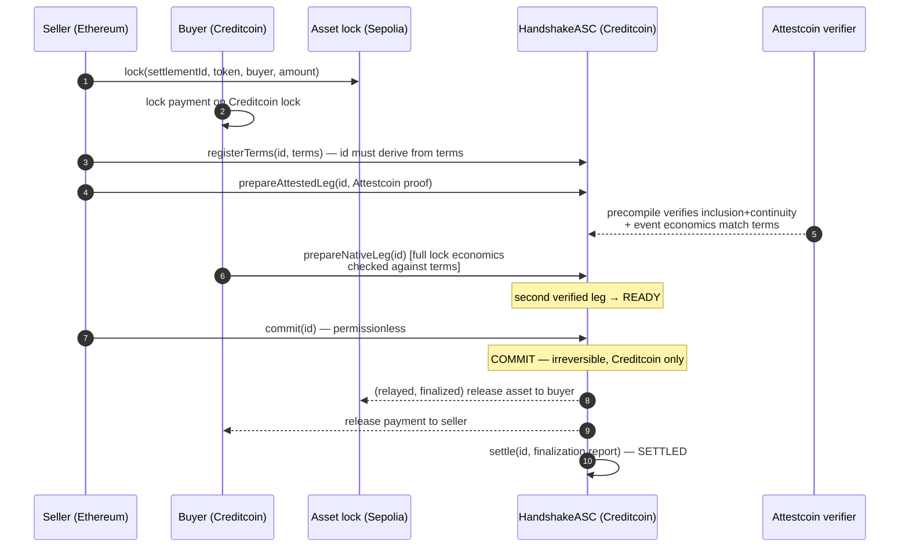
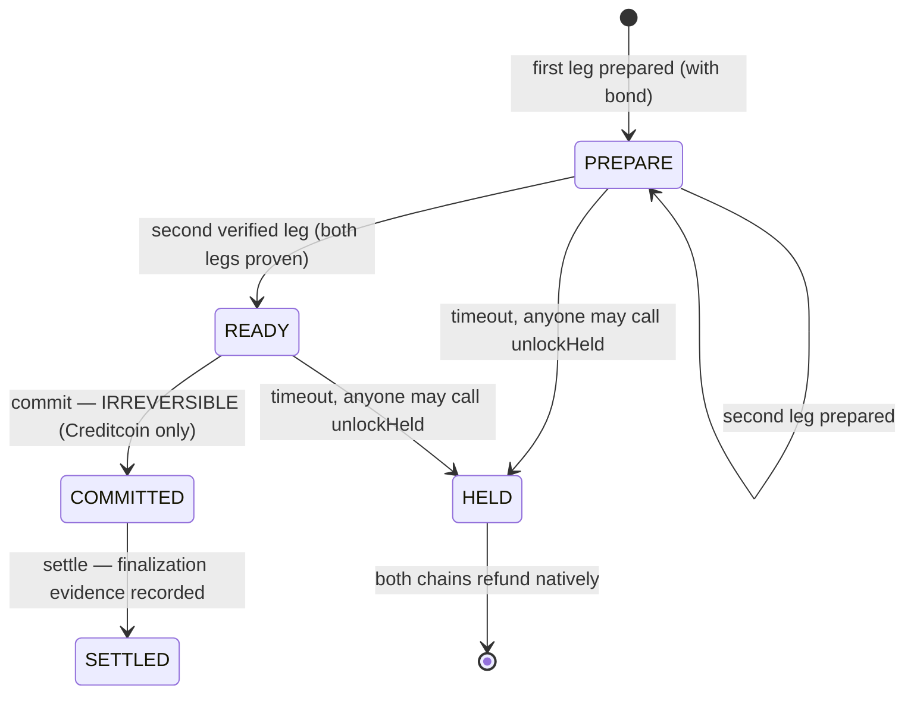

# Handshake

> **Cross-chain Delivery-versus-Payment settlement on Creditcoin — assets never leave their chains.** Handshake locks payment and asset under native custody on two chains, proves the foreign lock to Creditcoin with Attestcoin, and enforces one irreversible `COMMIT`. Zero bridges. Zero wrapping. Zero centralized oracles.

Built for **BUIDL CTC 2026 Fall (DeFi track)** on Creditcoin + the Attestcoin Protocol.

---

## How it works in 10 seconds

```
 Ethereum Sepolia                 Creditcoin Testnet
┌─────────────────────┐          ┌──────────────────────────────┐
│  Asset lock (ERC-20)│          │  HandshakeASC (coordinator)  │
│  NativeSettlementLock◄─Attestcoin─► State machine:            │
│                     │  proof    │  PREPARE → READY → COMMIT   │
│  Release only after │          │        ↘ timeout → HELD      │
│  Creditcoin COMMIT  │          │  Payment lock (native CTC)   │
└─────────────────────┘          └──────────────────────────────┘
```

Both parties lock funds on their own chains. Attestcoin's decentralized
attestors + Merkle inclusion + continuity proofs bring the *evidence* of the
Ethereum lock to Creditcoin — never the asset. The coordinator registers the
canonical trade terms (the settlement id itself is derived from them and
cannot drift), verifies both legs' full economics against those terms, and
once both are proven, `COMMIT` is called — the single point of no return. Miss
a timeout anywhere and either party can unilaterally refund — no attestor
required.

### Sequence



If any step stalls past its timeout window, anyone calls `unlockHeld(id)` and
both chains refund natively. Recovery never depends on attestor uptime.

### The three chains' roles

| Layer | Chain | Role |
|---|---|---|
| **Asset leg** | Ethereum Sepolia | Seller's ERC-20 locked in `NativeSettlementLock`; released only after a finalized Creditcoin `COMMIT` is reported by the operator-signed adapter, refundable by anyone after expiry |
| **Settlement coordination** | Creditcoin Testnet | `HandshakeASC` runs the canonical state machine, verifies Attestcoin proofs via the Block Prover precompile, and enforces the irreversible `COMMIT` boundary |
| **Attestation** | Attestcoin Protocol | Decentralized attestor quorum produces inclusion + continuity proofs of the Ethereum lock; Creditcoin's precompile verifies them on-chain |

---

## Try Handshake in 3 minutes

Against the deployed public testnets (read-only checks — no keys needed):

```bash
git clone https://github.com/zarkbns/handshake && cd handshake
npm install && (cd web && npm install)   # deps
git submodule update --init --recursive  # pinned forge-std (see foundry.lock)
npm test                                 # 49 Solidity tests + script + web suites

# Verify the live deployment is healthy (read-only, ~30s):
export CREDITCOIN_RPC_URL=https://rpc.cc3-testnet.creditcoin.network
export ETHEREUM_SEPOLIA_RPC_URL=https://ethereum-sepolia-rpc.publicnode.com
export HANDSHAKE_ASC_ADDRESS=0x905E0f141D8B5333F49755B08395d1beAdEd74Ab
export ATTESTCOIN_VERIFIER_ADDRESS=0xcB04133cEeD70bbb9692D528F21B7205838eAa13
export CREDITCOIN_COMMIT_STATUS_ADDRESS=0x2002dcc1341707e7a6D6d5dC49EE7e610B9d4680
export CREDITCOIN_LOCK_ADDRESS=0xb3e9cB40A52EF777A29b6198f4c2D8d19893a01D
export ETHEREUM_LOCK_ADDRESS=0x999326d027316C6CD0156a39ac8d3792f2EFC802
export ETHEREUM_COMMIT_STATUS_ADDRESS=0xbD42128dFDd2B381fF416FffE8D699F840562067
npm run verify
```

The verify step checks both chain ids, every contract's bytecode, and the full
cross-chain wiring — the fastest way to confirm the deployment is real.

**Full live demo** (needs two funded testnet wallets — see
[DEPLOYMENT.md](./DEPLOYMENT.md) for keys/faucets and the one-time demo-token
setup):

```bash
npm run demo:lock      # 1. lock both legs, derives + persists the settlement plan
npm run demo:settle    # 2. real Attestcoin proof → PREPARE → READY → COMMIT
npm run demo:release   # 3. deliver both legs after COMMIT → SETTLED
npm run demo:refund    # 4. (separate settlement) unilateral HELD refund, no attestor
```

Each step prints the on-chain state as it advances (`PREPARE → READY →
COMMITTED → SETTLED`) and is idempotent — safe to re-run if a step failed
halfway.

---

## State machine



| State | Meaning | Who can advance it |
|---|---|---|
| `PREPARE` | One or both legs locked + registered, bonds posted | Each party prepares its own leg |
| `READY` | Both legs proven (Attestcoin proof verified by the precompile) | Anyone (keeper/relayer) |
| `COMMITTED` | Point of no return — settled on Creditcoin | Anyone, within the window |
| `SETTLED` | Both chains delivered, evidence recorded | Anyone |
| `HELD` | Timed out — refund path, no attestor needed | Anyone, permissionless |

## Security guarantees (each one tested)

Every guarantee below is enforced by contract code and covered by the Foundry
test suite (`forge test`):

| Guarantee | Test(s) |
|---|---|
| Settlement id is enforced as the canonical derivation of the full terms (no drift, no substitution) | `testRegisterTermsRejectsNonCanonicalId`, `testRegisterTermsRejectsConflictingTerms`, `testPrepareRequiresRegisteredTerms` |
| Native leg economics fully verified (token, depositor, recipient, amount, expiry) | `testNativeLegRejectsWrongToken`, `testNativeLegRejectsWrongAmount`, `testNativeLegRejectsWrongRecipient`, `testNativeLegRejectsWrongExpiry`, `testNativeLegRejectsWrongDepositorParty` |
| Foreign-chain lock can never satisfy the native leg | `testNativeLegRejectsForeignRightChainTerms` |
| Attested-leg proof is bound to the registered terms' economics | `testAttestedLegPassesTermsToVerifier`, `testAttestedLegRejectsWhenVerifierBindingFails` |
| No COMMIT before both legs are proven (READY gate) | `testCannotCommitBeforeReady`, `testPrepareRequiresVerifiedAttestedLeg`, `testSecondVerifiedPrepareTransitionsToReady` |
| COMMIT is irreversible and only happens on Creditcoin | `testDoubleCommitRejected`, `testCommittedSettlementCannotBeHeld` |
| HELD recovery is timeout-based, unilateral, attestor-independent | `testHeldRecoveryNeedsNoVerifier`, `testUnlockHeldBeforeTimeoutRejected` |
| Same party cannot occupy both legs | `testSamePartyCannotPrepareBothLegs` |
| Settlement ids deterministically bind every trade field (JS matches Solidity byte-for-byte) | `testChangingAnyTradeFieldChangesId`, `testLegOrderIsIntentional`, `testSettlementIdMatchesSolidityByteForByte` |
| Griefing bonds: honest first mover always refunded | `testSingleLegTimeoutRefundsHonestMoverInFull`, `testCommitRefundsBothBondsInFull` |
| Window expiry is enforced everywhere | `testCommitWindowExpiryFallsToHeld`, `testSecondPrepareLegRejectedAfterPrepareWindow` |
| Source locks refund after expiry without COMMIT; release requires COMMIT | `testRefundIsPermissionlessAfterExpiryWithoutCommit`, `testRefundCannotBypassCommitAfterExpiry`, `testReleaseRequiresCreditcoinCommit` |
| Operator reports are signature-bound to chain + deployment + settlement | `testSignatureIsBoundToThisDeployment`, `testRejectsNonOperatorSignature` |

**Trust model (stated plainly).** Handshake inherits Attestcoin's decentralized
attestor quorum (BLS-aggregated signatures + continuity proofs) for proving the
Ethereum lock. It adds no new trusted parties on the refund path: HELD → refund
requires zero attestor cooperation. Residual quorum-collusion risk on the
attestation path is inherited, not eliminated — Handshake claims verifiable
settlement coordination, not bank-grade legal finality. See
[GUIDE.md](./GUIDE.md) for the full trust analysis.

---

## Architecture

| Component | Responsibility | Source |
|---|---|---|
| `HandshakeASC` | Canonical state machine, dual-PREPARE gate, COMMIT boundary, bonds | [`src/HandshakeASC.sol`](./src/HandshakeASC.sol) |
| `AttestcoinVerifier` | Verifies Attestcoin proofs via Creditcoin precompile; binds the proven lock event to the settlement | [`src/AttestcoinVerifier.sol`](./src/AttestcoinVerifier.sol) |
| `NativeSettlementLock` | Non-custodial lock used on both chains — release only after COMMIT, permissionless refund after expiry | [`src/NativeSettlementLock.sol`](./src/NativeSettlementLock.sol) |
| `CreditcoinCommitStatus` | Reads COMMIT directly from the coordinator (same chain) | [`src/CreditcoinCommitStatus.sol`](./src/CreditcoinCommitStatus.sol) |
| `OperatorCommitStatus` | Operator-signed COMMIT reports for the Sepolia lock (documented compromise until Attestcoin writability ships) | [`src/OperatorCommitStatus.sol`](./src/OperatorCommitStatus.sol) |
| `SettlementId` | Canonical cross-chain id derivation (both parties, tokens, amounts, lock refs, expiry) | [`src/SettlementId.sol`](./src/SettlementId.sol) |

**Deployed (public testnets, verified by `npm run verify`):**

| Contract | Network | Address |
|---|---|---|
| `HandshakeASC` | Creditcoin Testnet | `0x905E0f141D8B5333F49755B08395d1beAdEd74Ab` |
| `AttestcoinVerifier` | Creditcoin Testnet | `0xcB04133cEeD70bbb9692D528F21B7205838eAa13` |
| `CreditcoinCommitStatus` | Creditcoin Testnet | `0x2002dcc1341707e7a6D6d5dC49EE7e610B9d4680` |
| Creditcoin payment lock | Creditcoin Testnet | `0xb3e9cB40A52EF777A29b6198f4c2D8d19893a01D` |
| `OperatorCommitStatus` | Ethereum Sepolia | `0xbD42128dFDd2B381fF416FffE8D699F840562067` |
| Ethereum asset lock | Ethereum Sepolia | `0x999326d027316C6CD0156a39ac8d3792f2EFC802` |

> Note: the deployed coordinator predates the security-remediation upgrade
> (canonical terms binding, full leg-economics verification, griefing bonds) —
> `npm run verify` reports the missing bond config as `WARN`. The repo code is
> the source of truth; redeploy before running the live demos.

### Timeout recovery keeper

Any funded wallet can drive timeout recovery permissionlessly — no attestor,
no operator key:

```bash
node scripts/keeper-timeouts.js --dry-run   # scan for timed-out settlements
node scripts/keeper-timeouts.js             # move them to HELD
```

### Repo layout

```
src/           Solidity contracts (coordinator, verifier, locks, adapters)
test/          Foundry test suites (49 tests) + Node script tests
script/        Foundry deploy scripts (Creditcoin side, Ethereum side)
scripts/       Live demo + relayer tooling (Node, ethers, USC SDK)
web/           Read-only settlement dashboard (Vite + React)
config/        Testnet connection config template
GUIDE.md       Full design doc: trust model, sequencing, recovery semantics
DEPLOYMENT.md  Deployment, verification, and demo-run instructions
```

### Reproduce everything

```bash
npm install                                # root deps FIRST — forge builds need @gluwa/usc-contracts from node_modules
(cd web && npm install)                    # dashboard deps
git submodule update --init --recursive    # pinned forge-std (see foundry.lock)
npm test                                   # contracts + script tests + web tests
npm run verify                             # live deployment health check (read-only)
```

> `forge build` / `forge test` import `@gluwa/usc-contracts` through
> `node_modules` (see `remappings.txt`) — run `npm install` before any forge
> command in a fresh clone, or compilation fails with unresolved imports.

Contract tests: `forge test` · Gas snapshot: `forge snapshot` · Web dashboard:
`cd web && npm run dev`

---

## Documentation

- [GUIDE.md](./GUIDE.md) — full trust model, COMMIT sequencing, reorg handling, recovery semantics
- [DEPLOYMENT.md](./DEPLOYMENT.md) — deploy, verify, and run the live demo end to end

## Security notes

Handshake inherits Attestcoin's decentralized attestor security model (quorum +
aggregated signatures + continuity proofs). The refund path depends on no
attestor. This is not legal finality equivalent to traditional CCPs; residual
quorum and liveness assumptions on the attestation path apply and are stated in
GUIDE.md.

## License

MIT
